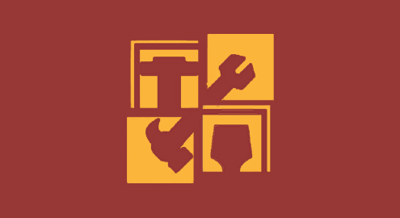
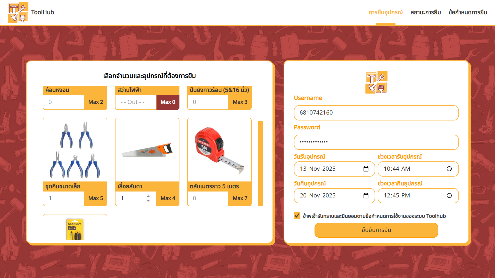
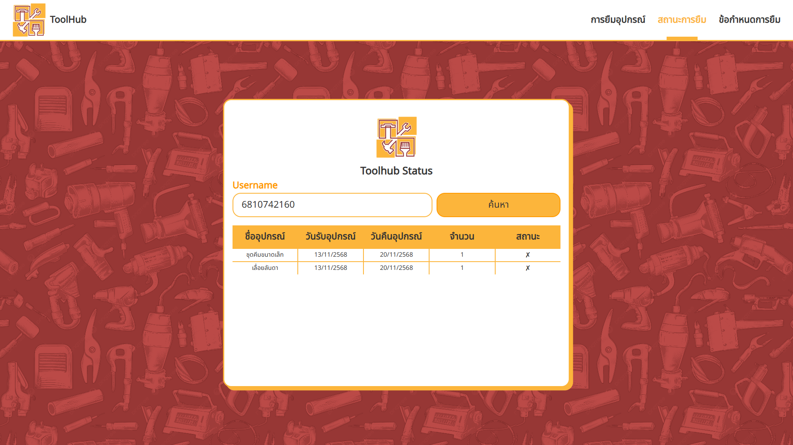
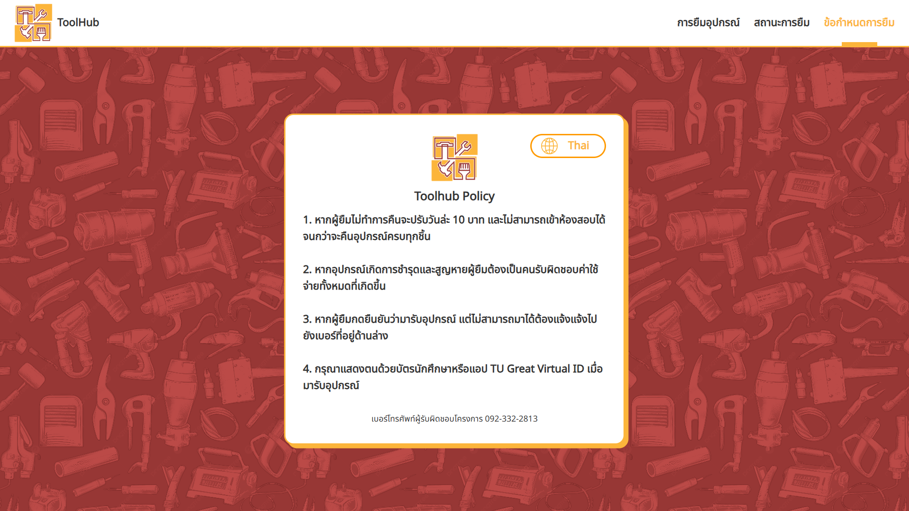
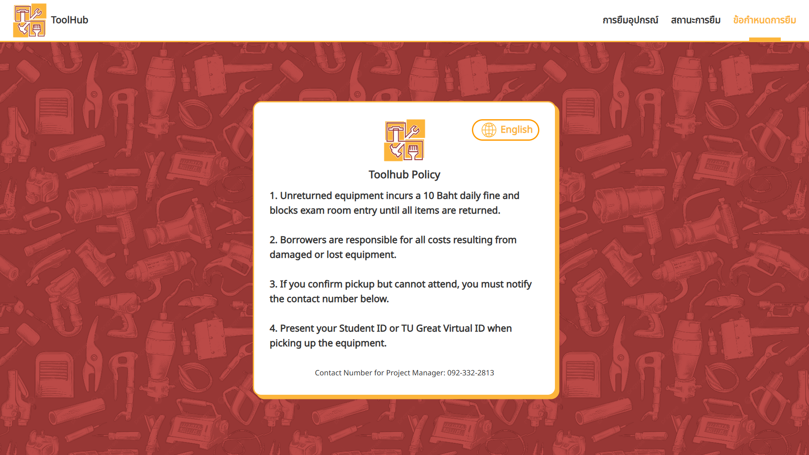

# 🛠️ ToolHub

  

  
  
  
  

---

## ✨ Overview

ToolHub is a web application developed for **Thammasat University** to simplify the process of borrowing engineering tools.

Instead of relying on manual requests or paperwork, students can reserve equipment online, monitor their borrowing status, and review borrowing policies through a single, easy-to-use interface. The platform helps streamline equipment management while making essential project tools more accessible to the university's engineering community.

## 🚀 Features

| Feature               | Description                                                                                                                         |
| --------------------- | ----------------------------------------------------------------------------------------------------------------------------------- |
| **Tool Booking**      | Reserve engineering tools by selecting the desired equipment, borrow and return dates, and submitting a request using a TU account. |
| **Borrowing Status**  | Track current and previous borrowing records, including borrowed items, quantities, dates, and return status.                       |
| **Borrowing Policy**  | View borrowing rules, requirements, and guidelines before submitting a request.                                                     |

## 🌱 Future Improvements

| Planned Feature                | Description                                                                           |
| ------------------------------ | ------------------------------------------------------------------------------------- |
| **Administrator Dashboard**    | Allow staff to approve requests and manage inventory through a dedicated admin panel. |
| **QR Code Check-in**           | Simplify equipment pickup and returns using QR code scanning.                         |
| **Email Notifications**        | Notify students about booking confirmations, due dates, and overdue returns.          |
| **Equipment Availability**     | Display real-time inventory and reservation schedules.                                |
| **Authentication Integration** | Integrate directly with Thammasat University's authentication system.                 |

## 🌐 Live Demo

Try ToolHub online:

**https://toolhub-ab219.web.app/**

## 🖥 Built With

<table>
<tr align="center">
<td width="100">

</td>

<td width="100">

</td>

<td width="100">

</td>
</tr>

<tr align="center">
<td>React</td>
<td>Tailwind</td>
<td>Firebase</td>
</tr>
</table>

## 📸 Screenshots

<table>
<tr>
<td align="center">

 <b>Tool Booking</b>
</td>

<td align="center">

 <b>Borrowing Status</b>
</td>
</tr>
</table>

<table>
<tr>
<td align="center">

 <b>Borrowing Policy (In Thai)</b>
</td>

<td align="center">

 <b>Borrowing Policy (In English)</b>
</td>
</tr>
</table>

## 🤝 Contributing

Contributions, feature requests, and suggestions are always welcome.

If you have ideas that could improve ToolHub, feel free to open an issue or submit a pull request.

## ⭐ Support

If you find ToolHub useful, consider giving the repository a ⭐.

It helps more people discover the project and supports future development.

## 📄 License

This project is licensed under the [MIT License](LICENSE).
